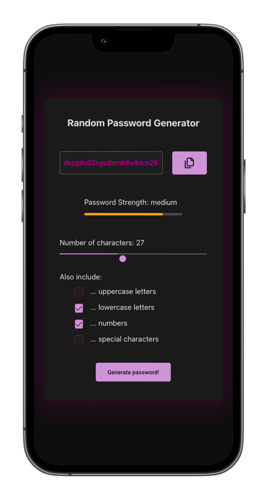

# Password Generator 🔑

## 📝 Project Overview

This  thirt project of the series was developed to provide users with a simple and efficient way to generate secure passwords.

The application supports various options, including uppercase letters, lowercase letters, numbers, and special characters, enabling users to tailor their passwords effectively.

A deployed [version](https://password-generator.nolliechtn6.com/) of the project is now available! 🚀

## ✨ Features

- **Customizable password options**: users can select the type of characters to include, such as uppercase, lowercase, numbers, and special characters.
- **Adjustable password length**: easily set the desired length for the generated password.
- **Password strength indicator**: visualize the strength of the generated password using a color-coded progress bar.
- **Copy to clipboard**: quickly copy the generated password for easy use.
- **User-friendly interface**: designed with simplicity and functionality in mind for an optimal user experience.

## 🔧 Technologies Used

- React
- PrimeReact for UI components
- `react-copy-to-clipboard` for clipboard functionality
- CSS for styling

## 🚀 How to Run the Project

To get the Password Generator Application running locally, follow these steps:

1. Clone the repository.
2. Run `npm install` in your terminal to install the necessary dependencies.
3. Start the development server using `npm run dev`.

You are now ready to generate secure passwords!

## ✅ Future Improvements

- [x] Enhance password generator efficiency
- [ ] Test password generation with Vitest
